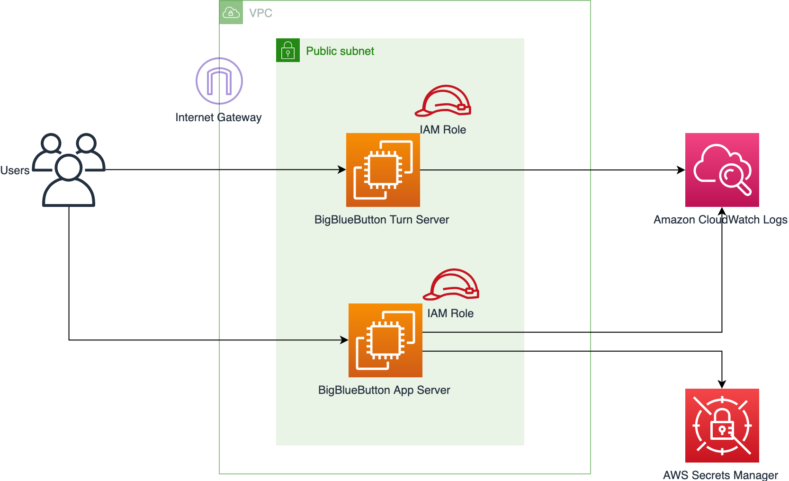
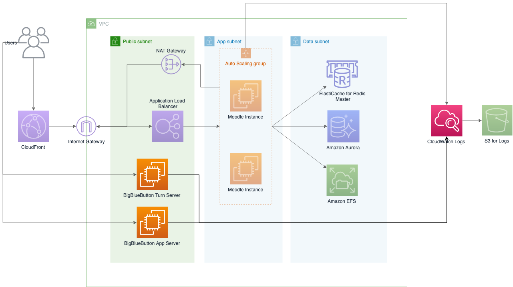
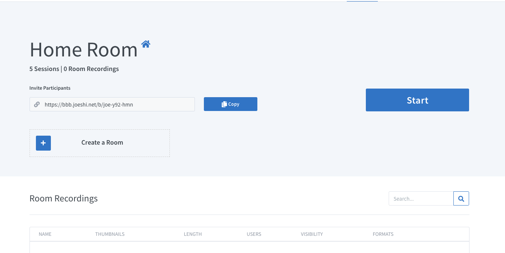

# BigBlueButton on AWS 

[English Version](./README_EN.md)

是一个开源Web会议系统。BigBlueButton支持实时共享音频，视频，幻灯片（带有白板控件），聊天和屏幕。 除此以外，BigBlueButton 经常被与
LMS(Learning Management System) 来结合使用，例如 Moodle。 教师可以使偏远地区的学生参与投票，表情符号，多用户白板和分组讨论室。 
演示者可以记录和回放内容，以便以后与他人共享。BigBlueButton可用于在线学习（尽管它可以用于许多其他应用程序）。

在这个项目里，我们提供 BigBlueButton 开源 Web 会议系统在 AWS 中国区的一键部署方案，BigBlueButton 可以在电脑、手机、平板等众多
平台上直接使用。您可以使用此解决方案自动设置在线Web会议系统，也可以将其与我们先前发布的
[Moodle 中国区快速部署方案](https://github.com/aws-samples/moodle-on-aws-cn) 结合使用。通过与 Moodle 的结合使用，我们可以快速部署
一套完整的在线学习解决方案。

- **适用区域:** cn-northwest-1(宁夏), cn-north-1(北京)
- **版本:** v1.0
- **预计部署时间:** 60min

如果您在部署过程中出现问题，可以通过 [GitHub Issues](https://github.com/aws-samples/big-blue-button-on-aws-cn/issues) 联系我们。

## 架构

您可以选择直接部署 Web Conference 系统，以下是方案的架构图。

或者您可以与[Moodle 中国区快速部署方案](https://github.com/aws-samples/moodle-on-aws-cn) 结合使用，架构图如下:

 

## 部署说明

1. 本解决方案提供 BigBlueButton 在 AWS 中国区域的一键化部署方案. BigBlueButton 使用 
[GNU Lesser General Public License V3](https://www.gnu.org/licenses/lgpl-3.0.html), 通过本解决方案启动 BigBlueButton 
则视为接受 [BigBlueButton 协议](https://bigbluebutton.org/open-source-license/).

1. **准备 ICP 备案过的域名**. 在中国大陆地区部署 Web 服务需要有 ICP 备案过的域名，才能合法得运行您的业务。请提前准备好 ICP 备案过的域名.

1. **申请2个弹性IP**. 这2个弹性IP分别用于 Turn Server 和 App Server.

1. **配置 DNS 解析**. 配置 DNS 使 Turn Server 和 App Server 的域名分别指向两个弹性IP.

## 步骤1: 启动 CloudFormation 堆栈

此自动化 AWS CloudFormation 模板在 AWS Cloud 上部署 BigBlueButton 应用程序。

您负责运行此解决方案时使用的AWS服务的成本。 有关更多详细信息，请参见“费用”部分。 有关完整详细信息，请参阅此解决方案中将使用的每个AWS服务的定价页面。

1. 登录到AWS管理控制台，然后单击下面的按钮以启动 AWS CloudFormation 模板。

    
    
1. 默认情况下，该模板在 AWS 宁夏区域启动。 要在其他AWS区域中启动该解决方案，请使用控制台导航栏中的区域选择器。

1. 在**创建堆栈**页面上，确认 **Amazon S3 URL** 文本框中显示正确的模板URL，然后选择**下一步**。

1. 在**指定堆栈详细信息**页面上，为解决方案堆栈分配名称。

1. 在**参数**下，查看模板的参数并根据需要进行修改。 此解决方案使用以下默认值。

    **General AWS**

    | 参数            | 默认值    | 描述                                                  |
    | --------------- | --------- | ----------------------------------------------------- |
    | EC2 Key Pair    |           | EC2 Key Pair 名称，用于登录 Web 实例 |
    | SSH Access From | 0.0.0.0/0 | 允许登录 Bastion 的 IP 地址段 (CIDR格式)              |

    **Network**

    | 参数                         | 默认值        | 描述                                                         |
    | ---------------------------- | ------------- | ------------------------------------------------------------ |
    | VPC ID                       |               | 选择已经存在的 VPC                                            |
    | Subnet ID                    |               | 选择已经存在的 Subnet, 必须是公有子网                            |

    **BigBlueButton General Information**

    | 参数                 | 默认值         | 描述                                     |
    | -------------------- | -------------- | ---------------------------------------- |
    | Email                |                | 用于通过 Let's encrypt 生成 SSL 证书       |
    | Secret ID            | 12345678       | 用于Turn Server 和 App Server 之间通讯     |

    **Turn Server**

    | 参数               | 默认值      | 描述               |
    | ------------------ | ----------- | ------------------ |
    | Instance Size      | c5.large    | Turn 服务器大小     |
    | Domain Name        |             | Turn Server 域名，在生产环境中必须配置      |
    | EIP Allocation ID  |             | EIP 的 Allocation ID      |
    | Disk Size          | 100         | 磁盘大小     |

    **App Server**

    | 参数               | 默认值      | 描述               |
    | ------------------ | ----------- | ------------------ |
    | Instance Size      | c5.2xlarge    | App 服务器大小     |
    | Domain Name        |             | App Server 域名，在生产环境中必须配置      |
    | EIP Allocation ID  |             | EIP 的 Allocation ID      |
    | Disk Size          | 100         | 磁盘大小     |
    
    **Greenlight Admin Account**

    | 参数               | 默认值      | 描述               |
    | ------------------ | ----------- | ------------------ |
    | Account Name      | Admin    | Greenlight 用户名称     |
    | Email        |             | 管理员用户邮箱，您需要通过此邮箱登陆管理员账号      |
    | Password  |             | 管理员用户密码      |

2. 选择**下一步**。

3. 在**配置堆栈选项**页面上，选择“下一步”。

4. 在**审核**页面上，查看并确认设置。 确保选中确认模板将创建 AWS Identity and Access Management（IAM）资源的框。

5. 选择**创建堆栈**以部署堆栈。

您可以在AWS CloudFormation控制台的**状态**列中查看堆栈的状态。 您应该在大约60分钟内看到状态为CREATE_COMPLETE。

## 步骤2：通过 Greenlight 登陆 BigBlueButton 控制台

[Greenlight](https://github.com/bigbluebutton/greenlight) 基于 BigBlueButton 构建的在线会议系统UI. 如果您的使用场景是在线会议，
可以直接按下面的步骤直接使用 Greenlight, 如果您的场景是在线教育，则可以忽略该步骤，搭配 Moodle 来使用。

1. 在 AWS CloudFormation 控制台，选择创建的堆栈（不要选择嵌套堆栈）, 选择**输出**

1. 在**输出**中找到 **AppServerEndpoint**，复制并且在浏览器中该地址，您可以使用 HTTP 或者 HTTPS 的方式访问

3. 使用启动模板时配置的 **Greenlight Email** 及 **Greenlight Password** 登陆，登陆成功后，您可以看到如下界面表示软件安装成功

## 常见问题

**Q: 部署失败了，如何查看失败的原因?**

默认情况下，我们的程序会通过 [CloudWatch Agent](https://docs.aws.amazon.com/AmazonCloudWatch/latest/monitoring/Install-CloudWatch-Agent.html) 
将日志上传到 [CloudWatch Logs](https://docs.aws.amazon.com/AmazonCloudWatch/latest/logs/WhatIsCloudWatchLogs.html) 
服务中，您可以登陆控制台，查看具体的错误原因。如果 CloudWatch Agent 未能在您的实例上正确启动，您需要登陆到机器查看错误原因。
日志文件位于 `/var/log/cloud-init-output.log`. 如果您无法自行解决，可通过 [GitHub Issues](https://github.com/aws-samples/big-blue-button-on-aws-cn/issues)
联系我们。

**Q: 这个方案可以适用于 AWS 海外区域吗?**

暂时不能，如果您有需要，请开 GitHub Issues 联系我们。

**Q: 请问这个BigBlueButton 的架构支持高可用吗？**

暂不支持。目前这个 Template 只部署了一台 Turn 服务器, 一台 BigBlueButton App 服务器。如果您想提高并发能力，最直接的方法是提升服务器的
实例大小。我们会在后续的版本中更新支持高可用架构。