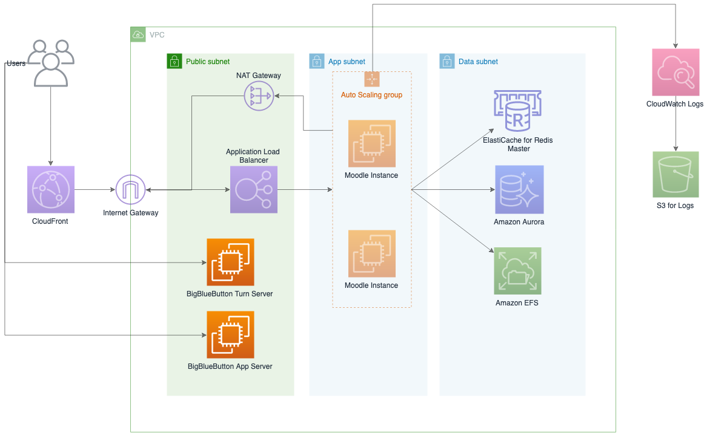

# BigBlueButton on AWS 

BigBlueButton 是一个在线会议系统，通过与 Moodle 的结合使用，我们可以快速部署一套完整的在线学习解决方案。该方案适用于在
[Moodle 方案](https://github.com/aws-samples/moodle-on-aws-cn)的基础上自动化部署 BigBlueButton.

- **适用Region:** cn-north-1(Beijing), cn-northwest-1(Ningxia)
- **版本:** v1.0
- **预计部署时间:** 60min

## 架构

我们在原有 Moodle 架构的基础上，增加了 BigBlueButton 的部署方案。

. 

## 部署说明

1. 准备 ICP 备案过的域名。在中国大陆地区部署 Web 服务需要有 ICP 备案过的域名，才能合法得运行您的业务。请提前准备好 ICP 备案过的域名。
如果您只是测试环境，可以先使用 EC2 的 DNS Name.

1. 申请2个弹性IP。 这2个弹性IP分别用于 Turn Server 和 App Server. 

1. 配置 DNS 解析，使 Turn Server 和 App Server 的域名分别指向两个弹性IP.

## 步骤1: 启动 CloudFormation 堆栈

此自动化 AWS CloudFormation 模板在 AWS Cloud 上部署 BigBlueButton 应用程序。

您负责运行此解决方案时使用的AWS服务的成本。 有关更多详细信息，请参见“费用”部分。 有关完整详细信息，请参阅此解决方案中将使用的每个AWS服务的定价页面。

1. 登录到AWS管理控制台，然后单击下面的按钮以启动 AWS CloudFormation 模板。

    
    
1. 默认情况下，该模板在 AWS 宁夏区域启动。 要在其他AWS区域中启动该解决方案，请使用控制台导航栏中的区域选择器。

1. 在**创建堆栈**页面上，确认 **Amazon S3 URL** 文本框中显示正确的模板URL，然后选择**下一步**。

1. 在**指定堆栈详细信息**页面上，为解决方案堆栈分配名称。

1. 在**参数**下，查看模板的参数并根据需要进行修改。 此解决方案使用以下默认值。

    **General AWS**

    | 参数            | 默认值    | 描述                                                  |
    | --------------- | --------- | ----------------------------------------------------- |
    | EC2 Key Pair    |           | EC2 Key Pair 名称，用于登录 Web 实例 |
    | SSH Access From | 0.0.0.0/0 | 允许登录 Bastion 的 IP 地址段 (CIDR格式)              |

    **Network**

    | 参数                         | 默认值        | 描述                                                         |
    | ---------------------------- | ------------- | ------------------------------------------------------------ |
    | VPC ID                       |               | 选择已经存在的 VPC                                            |
    | Subnet ID                    |               | 选择已经存在的 Subnet, 必须是公有子网                            |

    **BigBlueButton General Information**

    | 参数                 | 默认值         | 描述                                     |
    | -------------------- | -------------- | ---------------------------------------- |
    | Email                |                | 用于通过 Let's encrypt 生成 SSL 证书       |
    | Secret ID            | 12345678       | 用于Turn Server 和 App Server 之间通讯     |

    **Turn Server**

    | 参数               | 默认值      | 描述               |
    | ------------------ | ----------- | ------------------ |
    | Instance Size      | m5.large    | Turn 服务器大小     |
    | Domain Name        |             | Turn Server 域名，在生产环境中必须配置      |
    | Disk Size          | 100         | 磁盘大小     |

    **App Server**

    | 参数               | 默认值      | 描述               |
    | ------------------ | ----------- | ------------------ |
    | Instance Size      | m5.large    | App 服务器大小     |
    | Domain Name        |             | App Server 域名，在生产环境中必须配置      |
    | Disk Size          | 100         | 磁盘大小     |

2. 选择**下一步**。

3. 在**配置堆栈选项**页面上，选择“下一步”。

4. 在**审核**页面上，查看并确认设置。 确保选中确认模板将创建 AWS Identity and Access Management（IAM）资源的框。

5. 选择**创建堆栈**以部署堆栈。

您可以在AWS CloudFormation控制台的**状态**列中查看堆栈的状态。 您应该在大约30分钟内看到状态为CREATE_COMPLETE。

